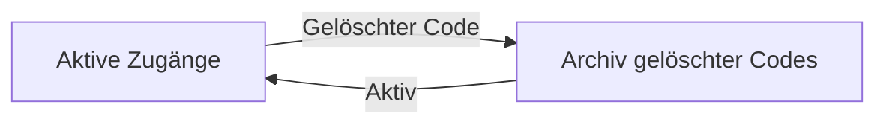

Die Seite **Zugangsverwaltung** — in der Plattform als **Gerätezugang (Zugangsverwaltung)** bezeichnet — ist die zentrale Steuerung für physische Zugänge in SUITEe. Hier können Unterkunftsbetreiber Zugangsdaten für Gäste, Personal und Dienstleister erstellen, den Synchronisierungsstatus mit Türschlössern überwachen und gelöschte Zugangsdaten nachvollziehen.

Navigieren Sie zu dieser Seite unter:

[https://hotel.suite-e.com/device-access](https://hotel.suite-e.com/device-access)

---

## Seitenübersicht

<Frame>
  
</Frame>

### Kopfzeile und zentrale Bedienelemente

- **Titel & Untertitel** — Die Seitenüberschrift lautet **Gerätezugang (Zugangsverwaltung)** mit dem Untertitel *Gerätezugang für Ihre Immobilie verwalten*. Ein Info-Symbol **ⓘ** bietet zusätzliche Hinweise zur Verwaltung von Zugangsdaten.
- **Gelöschter Code** — Über die orangefarbene Schaltfläche oben rechts wechseln Sie von den aktiven Zugangsdaten zum Archiv gelöschter Codes.
- **+ Zugangsdaten hinzufügen** — Die wichtigste Aktions-Schaltfläche rechts in der Filterleiste. Sie öffnet das Formular zum Erstellen neuer PIN- oder Kartenzugänge.

---

## Zwischen aktiven und gelöschten Codes wechseln

SUITEe trennt aktuell verwendete Zugangsdaten von bereits gelöschten Codes. Dadurch bleibt die operative Ansicht übersichtlich, während frühere Zugangsdaten weiterhin nachvollzogen werden können.

---

### Gelöschte Codes anzeigen

In der aktiven Ansicht befindet sich oben rechts die orangefarbene Schaltfläche **Gelöschter Code**:

<Frame>
  
</Frame>

Wenn Sie darauf klicken, wechselt die Oberfläche zum Archiv der gelöschten Zugangsdaten:

<Frame>
  
</Frame>

Das Archiv ist besonders hilfreich für:

- **Nachvollziehbarkeit** — Prüfen Sie frühere Zugangsdaten auch nach deren Löschung oder Widerruf.
- **Untersuchung von Vorfällen** — Sehen Sie, für wen ein Zugang erstellt wurde, welchem Zimmer bzw. Gerät er zugeordnet war und wann er gültig war.
- **Historische Übersicht** — Gelöschte und nicht mehr aktive Zugangsdaten werden getrennt von der täglichen operativen Ansicht dargestellt.

---

### Zur aktiven Zugangsverwaltung zurückkehren

Im Archiv gelöschter Codes ändert sich die Schaltfläche oben rechts zu **Aktiv**:

<Frame>
  
</Frame>

Klicken Sie auf **Aktiv**, um zur normalen Zugangsverwaltung zurückzukehren:

<Frame>
  
</Frame>

Hier stehen wieder alle Status-Tabs, Filter und aktiven Zugangsdaten für den täglichen Betrieb zur Verfügung.

---

## Filter- und Suchfunktionen

Über der Tabelle befindet sich eine Werkzeugleiste, mit der Sie Zugangsdaten schnell finden und nach verschiedenen Kriterien filtern können.

### Filter-Dropdown — Filtern nach

Ein Klick auf **Filtern nach** öffnet die verfügbaren Filterkriterien:

<Frame>
  
</Frame>

Oben im Dropdown befindet sich ein Suchfeld **Suche**, mit dem Sie die verfügbaren Filteroptionen schneller finden können.

### Verfügbare Filterkriterien

| Kriterium | Zweck | Beispiel |
| :--- | :--- | :--- |
| **Erstellt von** | Nach dem Ersteller der Zugangsdaten filtern | Zugangsdaten eines bestimmten Mitarbeiters anzeigen |
| **Immobilie** | Nach Unterkunft filtern | Zugangsdaten einer bestimmten Unterkunft anzeigen |
| **Wert** | Nach einem bestimmten Zugangswert suchen | Einen bestimmten PIN oder Zugangseintrag finden |
| **Zimmer** | Nach Zimmer oder Einheit filtern | Nur Zugänge für `UNIT-3` oder ein anderes Zimmer anzeigen |

Die verfügbaren Zimmer stammen aus dem Bereich [Zimmer](/de/dashboard/rooms).

---

### Gültigkeitszeitraum

Über die Datumsauswahl **Gültigkeitszeitraum wählen** bzw. **Zeitraum auswählen** können Sie Zugangsdaten nach ihrem Gültigkeitszeitraum filtern.

Dies ist beispielsweise hilfreich, wenn Sie:

- Zugänge während eines bestimmten Aufenthalts überprüfen möchten
- Zugangsdaten für ein bestimmtes Wochenende oder einen Zeitraum suchen
- Überschneidende temporäre Zugänge kontrollieren möchten

---

### Suche

<Frame>
  
</Frame>

Das Suchfeld verwendet den Platzhalter:

`Suche nach Immobilie, Zimmername, Erstellt von, Benutzername`

Sie können damit unter anderem suchen nach:

1. **Immobilie** — Name der Unterkunft
2. **Zimmername** — z. B. `UNIT-3`, `UNIT-5` oder `102`
3. **Erstellt von** — Name des Mitarbeiters oder Benutzers, der den Zugang erstellt hat
4. **Benutzername** — Name oder Kennung des Empfängers der Zugangsdaten

<Tip>
  Wenn Sie einen bestimmten Gast oder Mitarbeiter suchen, beginnen Sie mit dessen Namen. Für technische Prüfungen ist die Suche nach Zimmername häufig am schnellsten.
</Tip>

---

### Aktualisieren

Direkt neben dem Suchfeld befindet sich die Schaltfläche **↻**.

Klicken Sie darauf, um die angezeigten Zugangsdaten und deren aktuellen Status neu zu laden. Dies ist besonders hilfreich, nachdem Sie neue Zugangsdaten erstellt oder ein Verbindungsproblem mit einem Schloss behoben haben.

---

### Zugangsdaten hinzufügen

Die orangefarbene Schaltfläche **+ Zugangsdaten hinzufügen** öffnet den Assistenten zur manuellen Erstellung neuer Zugangsberechtigungen.

Je nach Hardware und Konfiguration Ihrer Unterkunft können Sie beispielsweise:

- Einen zeitlich begrenzten **PIN-Code** erstellen
- Eine physische **Zugangskarte** konfigurieren
- Ein oder mehrere Zimmer auswählen
- Optional den Haupteingang einschließen
- Start- und Ablaufzeit festlegen

---

## Status-Tabs

Die Status-Tabs oberhalb der Tabelle filtern die Zugangsdaten nach ihrem aktuellen Zustand.

### Erstellt

Der Tab **Erstellt** zeigt Zugangsdaten, die erfolgreich erstellt wurden.

<Frame>
  
</Frame>

Wenn aktuell keine passenden Zugangsdaten vorhanden sind, zeigt die Tabelle **Keine Daten verfügbar**.

Sobald neue Zugangsdaten erfolgreich erstellt wurden, erscheinen sie hier mit ihrem aktuellen Status.

---

### Teilweise erstellt

Der Tab **Teilweise erstellt** zeigt Zugangsdaten, bei denen die Erstellung oder Synchronisierung nur teilweise erfolgreich war.

<Frame>
  
</Frame>

Dies kann beispielsweise auftreten, wenn ein Zugang für mehrere Türen vorgesehen ist und nicht alle beteiligten Geräte die Zugangsdaten erfolgreich übernommen haben.

<Info>
  Prüfen Sie bei einem teilweise erstellten Zugang, welche Geräte betroffen sind und ob diese aktuell online sind.
</Info>

---

### Abgelaufen

Der Tab **Abgelaufen** enthält Zugangsdaten, deren Gültigkeitszeitraum bereits beendet ist.

<Frame>
  
</Frame>

Bei PIN-Zugängen können unter anderem folgende Informationen angezeigt werden:

- **Passwort** — Der PIN wird standardmäßig als `*****` maskiert.
- **Auge-Symbol 👁** — Zeigt den PIN an, sofern diese Funktion für Ihren Benutzer verfügbar ist.
- **Kopieren-Symbol** — Kopiert den PIN in die Zwischenablage.
- **Typ** — Beispielsweise `PIN`.
- **Zimmer** — Das zugewiesene Zimmer, z. B. `UNIT-3`.
- **Geräte** — Das Türschloss oder Gerät, für das der Zugang erstellt wurde.
- **Zugangsstatus** — Beispielsweise **Abgelaufen**.
- **Erstellt von** — Benutzer, der die Zugangsdaten erstellt hat.
- **Gültig ab / Läuft ab am** — Start- und Endzeitpunkt der Zugangsberechtigung.

---

### Fehlgeschlagen

Der Tab **Fehlgeschlagen** zeigt Zugangsdaten, deren Erstellung oder Synchronisierung mit dem vorgesehenen Gerät nicht erfolgreich abgeschlossen werden konnte.

<Frame>
  
</Frame>

Bei fehlgeschlagenen Einträgen sollten Sie insbesondere prüfen:

- Ist das entsprechende Schloss unter [Geräte](/de/dashboard/devices) online?
- Hat das Gerät ausreichend Batterie bzw. Stromversorgung?
- Ist das zugehörige Gateway online?
- Ist das richtige Zimmer und Gerät ausgewählt?

<Warning>
  Wenn ein Zugang als **Fehlgeschlagen** angezeigt wird, sollten Sie nicht davon ausgehen, dass der Gast oder Mitarbeiter die Tür damit öffnen kann. Prüfen Sie den Gerätestatus und erstellen bzw. synchronisieren Sie den Zugang gegebenenfalls erneut.
</Warning>

---

### Alle

Der Tab **Alle** fasst Zugangsdaten aller Status in einer gemeinsamen Tabellenansicht zusammen.

<Frame>
  
</Frame>

Diese Ansicht eignet sich besonders für eine vollständige Übersicht oder wenn Sie nach einem bestimmten Benutzer suchen, ohne dessen aktuellen Zugangsstatus zu kennen.

---

## Tabellenspalten

Jede Spalte in der Zugangsverwaltung stellt einen bestimmten Teil der Zugangsberechtigung dar:

| Spalte | Beschreibung |
| :--- | :--- |
| **Benutzername** | Name oder Kennung des Empfängers der Zugangsdaten. |
| **Passwort** | Bei PIN-Zugängen wird der Sicherheitscode maskiert dargestellt. Bei Kartenzugängen kann stattdessen `-` angezeigt werden. |
| **Typ** | Art des Zugangs, beispielsweise **PIN** oder **CARD/Karte**. |
| **Zimmer** | Zimmer oder Einheit, für die der Zugang gilt. |
| **Geräte** | Gerät bzw. Türschloss, auf dem die Zugangsdaten verwendet werden. |
| **Zugangsstatus** | Aktueller Status, beispielsweise **Erstellt**, **Teilweise erstellt**, **Abgelaufen** oder **Fehlgeschlagen**. |
| **Erstellt von** | Benutzer oder System, das die Zugangsdaten erstellt hat. |
| **Gültig ab** | Zeitpunkt, ab dem der Zugang verwendet werden kann. |
| **Läuft ab am** | Zeitpunkt, zu dem der Zugang seine Gültigkeit verliert. |
| **Erstellt am** | Zeitpunkt, zu dem die Zugangsdaten in SUITEe erstellt wurden. |
| **Aktion** | Verfügbare Aktionen für den jeweiligen Zugang, abhängig von Status und Benutzerberechtigung. |

Die Zimmerinformationen sind mit [Zimmer](/de/dashboard/rooms) verbunden. Die zugehörigen Geräte können unter [Geräte](/de/dashboard/devices) überprüft werden.

---

## Neue Zugangsdaten erstellen

Um einem Gast, Mitarbeiter oder Dienstleister manuell Zugang zu gewähren, klicken Sie auf **+ Zugangsdaten hinzufügen**:

<Frame>
  
</Frame>

Dadurch öffnet sich das Formular **Zugangsdaten hinzufügen**. Auf der linken Seite konfigurieren Sie den Zugang Schritt für Schritt. Auf der rechten Seite zeigt die **Zusammenfassung** die ausgewählten Einstellungen.

Je nach Systemkonfiguration stehen zwei Zugangsarten zur Verfügung:

- **PIN** — Numerischer Zugangscode
- **Karte** — Physische Zugangskarte

---

## PIN-Zugang erstellen

Wählen Sie **PIN**, um einen numerischen Code für kompatible Türschlösser zu erstellen.

### Schritt 1 und 2 — Zugangsart und Zugangsbereich

<Frame>
  
</Frame>

### Schritt 1 — Zugangsart

Wählen Sie **PIN** als Zugangsart.

### Schritt 2 — Zugangsbereich

Konfigurieren Sie anschließend, wo der PIN verwendet werden darf:

- **Immobilie** — Die aktuell aktive Unterkunft ist vorausgewählt.
- **Zimmer** — Wählen Sie ein oder mehrere Zimmer aus. Die Zimmer stammen aus dem Bereich [Zimmer](/de/dashboard/rooms).
- **Haupteingang einschließen** — Aktivieren Sie diese Option, wenn derselbe Zugang zusätzlich für den Gebäudeeingang gelten soll.

<Info>
  Wenn **Haupteingang einschließen** aktiviert ist, berücksichtigt SUITEe zusätzlich zum ausgewählten Zimmer den konfigurierten Zugang zum Haupteingang.
</Info>

---

### Schritt 3 und 4 — Gültigkeit und Zugangsdaten

<Frame>
  
</Frame>

### Schritt 3 — Gültigkeit

Legen Sie fest, wann der Zugang aktiv sein soll:

- **Gültig ab** — Startdatum und Startzeit. Je nach Oberfläche kann der Zugang sofort oder zu einem zukünftigen Zeitpunkt aktiviert werden.
- **Läuft ab am** — Zeitpunkt, an dem der Zugang automatisch seine Gültigkeit verliert.

Für die Dauer können Schnelloptionen verfügbar sein:

- **1 Tag**
- **3 Tage**
- **1 Woche**
- **1 Monat**
- **Benutzerdefiniert**

### Schritt 4 — Zugangsdaten

- **Gast / Benutzername** — Geben Sie den Namen oder eine eindeutige Bezeichnung für den Empfänger ein.
- **Benutzerdefinierte PIN** — Falls verfügbar, können Sie einen eigenen PIN eingeben. Alternativ kann SUITEe automatisch einen PIN erzeugen.
- **Auge-Symbol 👁** — Ermöglicht die Überprüfung des eingegebenen PINs.

Die Karte **Zusammenfassung** auf der rechten Seite zeigt die gewählte Konfiguration vor dem Erstellen noch einmal an.

Klicken Sie anschließend auf **Zugangsdaten erstellen**.

<Tip>
  Prüfen Sie vor dem Erstellen besonders **Zimmer**, **Haupteingang** sowie **Gültig ab** und **Läuft ab am**. Dadurch vermeiden Sie, dass ein Zugang für die falsche Tür oder den falschen Zeitraum erstellt wird.
</Tip>

---

## Zugangskarte erstellen

Wenn Ihre Unterkunft mit kompatiblen Kartenlesern und Türschlössern ausgestattet ist, können Sie über **Karte** eine physische Zugangskarte konfigurieren.

### Schritt 1 und 2 — Kartenleser und Zugangsbereich

<Frame>
  
</Frame>

### Schritt 1 — Zugangsart

Wählen Sie **Karte**.

Daraufhin erscheint das Feld **Kartenleser**. Wählen Sie den Kartenleser aus, der zum Erstellen der Zugangskarte verwendet werden soll.

### Schritt 2 — Zugangsbereich

Wählen Sie:

- Die Unterkunft
- Ein oder mehrere Zimmer
- Optional **Haupteingang einschließen**

Damit legen Sie fest, welche Türen mit der Karte geöffnet werden können.

---

### Schritt 3 und 4 — Gültigkeit und Benutzer

<Frame>
  
</Frame>

### Schritt 3 — Gültigkeit

Legen Sie Start und Ende der Kartenberechtigung fest. Wie beim PIN-Zugang können Schnelloptionen wie **1 Tag**, **3 Tage**, **1 Woche**, **1 Monat** oder **Benutzerdefiniert** verfügbar sein.

### Schritt 4 — Zugangsdaten

Geben Sie den **Gast / Benutzernamen** ein.

Bei einer Zugangskarte ist kein numerischer PIN erforderlich. Die Karte wird über den ausgewählten Kartenleser mit dem Zugang verknüpft.

Die **Zusammenfassung** auf der rechten Seite zeigt die gewählten Einstellungen.

Klicken Sie anschließend auf **Zugangsdaten erstellen** und folgen Sie den Anweisungen auf dem Bildschirm für den ausgewählten Kartenleser.

---

## PIN und Karte im Vergleich

| Funktion | PIN | Karte |
| :--- | :--- | :--- |
| **Zugangsmedium** | Numerischer Code | Physische Zugangskarte |
| **Zusätzliche Hardware** | Kompatibles Schloss mit PIN-Eingabe | Kompatibles Schloss und Kartenleser |
| **PIN-Eingabe** | Automatisch erzeugt oder benutzerdefiniert, abhängig von der Konfiguration | Nicht erforderlich |
| **Übergabe an den Gast** | Code kann digital oder persönlich mitgeteilt werden | Physische Karte wird an den Gast übergeben |
| **Haupteingang** | Kann zusätzlich einbezogen werden | Kann zusätzlich einbezogen werden |
| **Anzeige in der Passwort-Spalte** | Maskierter PIN, sofern vorhanden | In der Regel `-` |

---

## Verbindung zu anderen Dashboard-Modulen

Die Zugangsverwaltung ist eng mit anderen Bereichen der SUITEe-Plattform verbunden:

- **[Geräte](/de/dashboard/devices)** — Die hier verwendeten Türschlösser werden im Gerätebereich verwaltet.
- **[Zimmer](/de/dashboard/rooms)** — Zimmer bestimmen, welchen Bereichen Zugangsdaten zugeordnet werden können.
- **[Buchung](/de/dashboard/booking)** — Gästebuchungen können mit der Erstellung und Verwaltung von Zugangsdaten verbunden sein.
- **[Aktivitätszentrum](/de/dashboard/activity-centre)** — Relevante Zugangs- und Geräteereignisse können hier nachvollzogen werden.
- **[Smart Locks](/de/devices/smart-locks)** — Weitere Informationen zu den elektronischen Türschlössern im SUITEe-System.